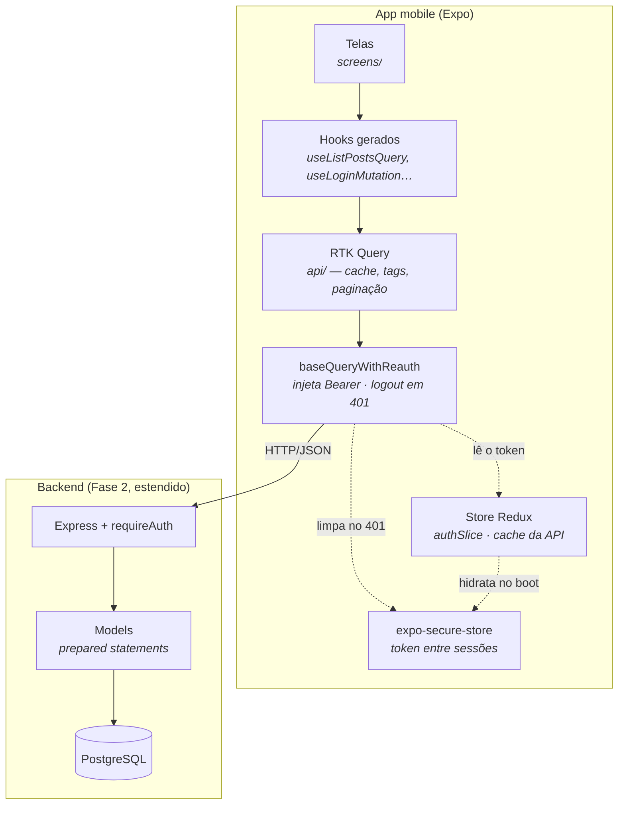

# Tech Challenge 4 — Mobile Blog (React Native)

App mobile em **React Native (Expo + TypeScript)** para a plataforma de blogging construída nas fases anteriores do Postech FullStack.

> **Status:** `todas as telas implementadas` — falta gravar o vídeo de demonstração. Ver [`docs/PLAN.md`](docs/PLAN.md).

## Escopo

Interface mobile para docentes e alunos consumirem a API REST do blog:

- **Leitura pública:** lista de posts com busca por palavra-chave e leitura completa, sem login.
- **Login de professores** com JWT persistido em `expo-secure-store`.
- **Área administrativa** (professores autenticados): CRUDs de posts, professores e alunos, todos paginados.

Alunos **não autenticam** — são cadastros administrados pelos professores. A separação é entre leitura anônima e escrita autenticada, e não entre papéis de usuário: todo professor é administrador. O único bloqueio é a auto-exclusão, que garante que sempre reste alguém com acesso.

## Telas

| # | Tela | Rota | Acesso |
|---|---|---|---|
| 1 | Lista de posts com busca | `PostList` | público |
| 2 | Leitura do post | `PostDetail` | público |
| 3 | Login | `Login` | público |
| 4 | Painel administrativo | `AdminHome` | 🔒 |
| 5 | Criar/editar post | `PostForm` | 🔒 |
| 6 | Lista de professores | `ProfessorsList` | 🔒 |
| 7 | Criar/editar professor | `ProfessorForm` | 🔒 |
| 8 | Lista de alunos | `StudentsList` | 🔒 |
| 9 | Criar/editar aluno | `StudentForm` | 🔒 |

## Stack

- **Expo SDK 57** (managed) + **TypeScript**, React Native 0.86
- **React Navigation 7** (native-stack + bottom-tabs)
- **Redux Toolkit** + **RTK Query**
- **expo-secure-store** (JWT), **react-hook-form** (formulários)
- **jest-expo** + **React Native Testing Library** (142 testes)

Sem biblioteca de UI: os componentes são escritos à mão sobre tokens de tema portados do admin web da Fase 3, para os dois clientes parecerem o mesmo produto.

## Arquitetura



O ponto central do desenho é o **`baseQueryWithReauth`**: ele é o único lugar que sabe de autenticação. Injeta o `Authorization: Bearer` em toda requisição e, ao ver um **401**, derruba a sessão e limpa o `SecureStore`. Nenhuma tela trata sessão expirada — a aba "Admin" simplesmente vira "Entrar" sozinha.

### Estrutura de pastas

```
src/
  api/          RTK Query: baseQuery, accumulatePages, um arquivo de endpoints por recurso
  store/        configureStore, authSlice, hydrate (restaura o token no boot), listeners
  navigation/   RootNavigator → AppTabs → PostsStack | AdminStack | AuthStack
  screens/      uma tela por item da tabela acima
  components/   Button, TextField, ErrorBoundary, EmptyState, LoadingView, ErrorView…
  hooks/        useDebounce (portado do TC3), useAuth, useLogout
  theme/        tokens de cor/spacing/tipografia portados do TC3
  types/        contratos espelhando as respostas do backend
  utils/        validators, formatDate, confirm, limits, apiError
```

### Fluxo de autenticação

1. **Login** → `useLoginMutation` → token gravado no `SecureStore` **antes** do state (se o app morrer entre as duas operações, a sessão sobrevive; na ordem inversa, o token se perderia).
2. **Toda requisição** passa pelo `prepareHeaders`, que lê o token do store.
3. **Qualquer 401** em sessão ativa → `logout()` + `SecureStore` limpo. Um listener descarta o cache do RTK Query junto, para os dados do professor anterior não reaparecerem no próximo login.
4. **No boot**, o `hydrateAuth` lê o token guardado e confirma com `GET /auth/me` antes de considerar a sessão válida — um token pode ter expirado ou pertencer a um professor já excluído.

O 401 do **próprio login** é exceção: ali significa "senha errada", não "sessão expirada", e não dispara o logout. Tratar os dois casos igual apagava a mensagem de erro da própria tentativa de login.

## Rodando o app

```bash
npm install
cp .env.example .env      # ajuste EXPO_PUBLIC_API_URL conforme a plataforma
npx expo start            # depois: w (navegador), a (Android), i (iOS) ou QR no Expo Go
```

O backend precisa estar de pé — ver [Backend](#backend).

### `EXPO_PUBLIC_API_URL` por plataforma

| Onde o app roda | Valor |
|---|---|
| Navegador (`w`) | `http://localhost:3000` |
| Simulador iOS | `http://localhost:3000` |
| Emulador Android | `http://10.0.2.2:3000` |
| Celular físico (Expo Go) | `http://<IP-da-máquina-na-LAN>:3000` |

`localhost` dentro do emulador Android aponta para o próprio emulador, não para a sua máquina — daí o `10.0.2.2`. Trocar o `.env` exige reiniciar o Metro: as variáveis `EXPO_PUBLIC_*` são embutidas no bundle.

> **Desenvolvendo no WSL?** Em modo NAT (o padrão), o IP do WSL não é visível para o resto da rede: **o QR code não funciona no celular**, porque ele não alcança nem o Metro nem a API. Saídas, em ordem de esforço:
>
> 1. **Navegador** (`npx expo start` e tecla `w`) — tudo roda na máquina e `localhost:3000` funciona. Ressalva: no web o `expo-secure-store` não existe e o app cai num fallback de `localStorage`, então isso **não** valida a persistência real do token.
> 2. **Port proxy no Windows** (PowerShell como administrador), que é o que libera o celular de verdade:
>    ```powershell
>    netsh interface portproxy add v4tov4 listenport=8081 listenaddress=0.0.0.0 connectport=8081 connectaddress=<IP-do-WSL>
>    netsh interface portproxy add v4tov4 listenport=3000 listenaddress=0.0.0.0 connectport=3000 connectaddress=<IP-do-WSL>
>    ```
>    Depois aponte o `EXPO_PUBLIC_API_URL` para o IP do **Windows** na LAN. O IP do WSL sai de `hostname -I`.
> 3. **`networkingMode=mirrored`** no `.wslconfig`, que faz o WSL compartilhar a rede do Windows e dispensa o proxy.
>
> `npx expo start --tunnel` resolve só o Metro — o celular continua sem alcançar a API.

## Testes

```bash
npm test             # 142 testes
npm run typecheck    # tsc --noEmit
```

Cobrem o `authSlice`, os validadores, a tradução de erro da API, o `useDebounce`, o `ErrorBoundary`, o `confirm` nas duas plataformas e — o mais importante — **todas as telas contra um `fetch` mockado**: injeção do Bearer, logout automático no 401, restauração da sessão no boot, busca com debounce, paginação acumulada e os CRUDs completos.

As respostas mockadas foram **copiadas de chamadas reais ao backend seedado**, então uma mudança de contrato quebra os testes. Ainda assim vale a ressalva: mock não é banco. As operações de escrita foram conferidas também contra o Postgres real, uma a uma.

## Backend

O app consome a API do repositório [`TheusSales/8fsdt-tech-challenge-2`](https://github.com/TheusSales/8fsdt-tech-challenge-2), **estendida nesta fase** com autenticação JWT, CRUD de professores e alunos, paginação e proteção das rotas de escrita:

| Recurso | Endpoints |
|---|---|
| Autenticação | `POST /auth/login`, `GET /auth/me` |
| Posts (público) | `GET /posts`, `GET /posts/:id`, `GET /posts/search?q=` |
| Posts (protegido) | `GET /posts/admin` (paginado), `POST`, `PUT /:id`, `DELETE /:id` |
| Professores | CRUD completo em `/professors`, paginado |
| Alunos | CRUD completo em `/students`, paginado |

Rotas protegidas exigem `Authorization: Bearer <token>`. Credenciais do seed: **`admin@fiap.com` / `admin123`**.

### Subindo o backend do zero

```bash
git clone https://github.com/TheusSales/8fsdt-tech-challenge-2
cd 8fsdt-tech-challenge-2
npm install
cp .env.example .env          # preencha JWT_SECRET
docker compose up -d
docker exec -i postgres_blog psql -U postgres -d blog_tech < src/scripts/schema.sql
npm run seed
npm run dev                   # http://localhost:3000
```

Requer **Node 20+** (exigência do Expo). Se o Node do sistema for antigo, o nvm resolve sem `sudo` e sem substituí-lo:

```bash
curl -o- https://raw.githubusercontent.com/nvm-sh/nvm/v0.40.6/install.sh | bash
# reabra o terminal, então:
nvm install --lts && nvm alias default 'lts/*'
```

Confirme que a API responde antes de subir o app:

```bash
curl -sX POST localhost:3000/auth/login -H 'content-type: application/json' \
     -d '{"email":"admin@fiap.com","password":"admin123"}'
```

## Relato de desafios

Os problemas mais instrutivos desta fase não foram os de escrever tela, e sim os de descobrir que algo estava errado. Registro os que custaram mais tempo — e o que cada um ensinou.

**1. Testes que mockam o banco não validam SQL.** O backend da Fase 2 tinha 77 testes verdes, e mesmo assim o script de seed quebrou na primeira execução real: um `INSERT ... SELECT` reutilizava o mesmo parâmetro em dois contextos e o Postgres inferia tipos diferentes (`text` num, `varchar` no outro). Nenhum teste pegou, porque todos mockam a camada de models. A lição valeu para o resto do projeto: toda operação de escrita foi conferida também contra o banco de verdade, e não só contra mock.

**2. Um 500 que devia ser 400.** Colar um texto longo no título de um post derrubava a requisição com erro 500. A causa era o `varchar(150)` da coluna: o Postgres recusava com o código `22001` e o `catch` genérico transformava isso em "erro interno". O efeito prático era pior que o erro em si — o app oferecia "tentar de novo" para algo que só o usuário podia resolver. Corrigimos nos dois lados: o backend passou a responder 400 informando os limites, e os campos ganharam `maxLength` com contador visível. O contador não é enfeite: com `maxLength` sozinho o campo apenas para de aceitar texto, o que parece travamento.

**3. Assinatura válida não prova que a conta existe.** Testando a tela de professores, notamos que era possível excluir a conta de outro professor. Isso é permitido por desenho, mas a investigação revelou algo pior: o `requireAuth` só verificava a assinatura do JWT. Como o token vale 8 horas, um professor **excluído** continuava criando posts e apagando outros professores nesse intervalo — verificado na prática, o mesmo token respondia 201 em `POST /posts` depois do `DELETE`. Só o `/auth/me` recusava, por ser o único ponto que consultava o banco. O middleware passou a confirmar a existência do professor, ao custo de uma consulta por requisição — o preço de revogar acesso na hora sem manter lista de tokens revogados.

**4. Erro que some sozinho.** Ao centralizar o logout automático em qualquer resposta 401, criamos um bug sutil: errar a senha no login também disparava o logout, que descartava o cache do RTK Query e levava junto a mensagem de erro *da própria tentativa de login*. O usuário digitava a senha errada e não via nada. A correção foi distinguir os casos — um 401 sem sessão ativa não é sessão expirada. Foi o teste da tela que expôs o problema, não a leitura do código.

**5. `Alert.alert` é uma função vazia no web.** O botão "Sair" não fazia nada no navegador, sem erro no console. O `react-native-web` implementa `Alert` como `static alert() {}`. Como o mesmo `Alert.alert` estava previsto para todas as confirmações de exclusão, o problema afetaria três telas. Viramos um utilitário `confirm()` que escolhe entre `window.confirm` e `Alert.alert` conforme a plataforma.

**6. Paginação acumulada exige três opções que só funcionam juntas.** Fazer as páginas somarem numa lista contínua no RTK Query pede `serializeQueryArgs` (senão cada página vira uma entrada de cache e a lista pisca inteira), `forceRefetch` (senão a busca nunca dispara, já que o argumento virou sempre o mesmo) e `merge`. Faltando qualquer uma, o comportamento quebra de um jeito diferente. Depois de repetir isso em três recursos, extraímos para `api/accumulatePages.ts`.

**7. Ambiente de desenvolvimento em WSL.** O IP da distro não é visível na rede local em modo NAT, então o QR code do Expo simplesmente não funciona no celular — e falha em silêncio, sem mensagem de erro. Documentamos as três saídas (navegador, port proxy no Windows, `networkingMode=mirrored`) porque perder tempo com isso é evitável.

## Vídeo de demonstração

> _A ser publicado no CP12._

## Documentação complementar

[`docs/PLAN.md`](docs/PLAN.md) traz o plano completo por checkpoint, os desvios em relação ao plano original e o registro do que foi verificado contra o banco real — separado do que só passou em mock.
